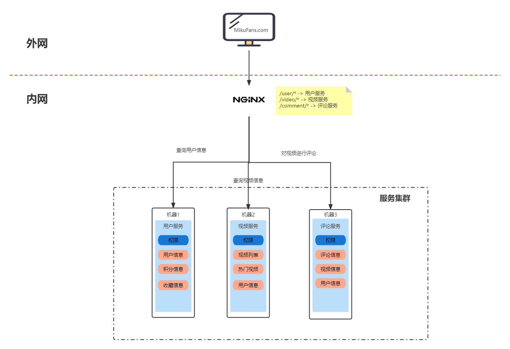
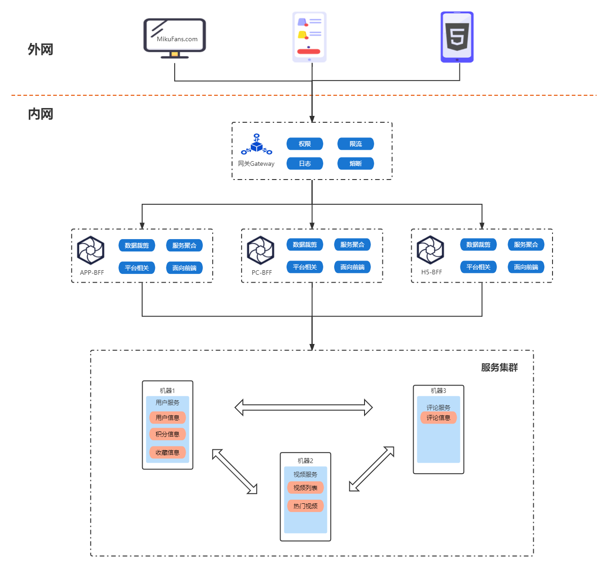

- [软件项目架构方案演进](#软件项目架构方案演进)
    - [阶段一: 单体应用](#阶段一-单体应用)
    - [阶段二：分布式-垂直拆分](#阶段二分布式-垂直拆分)
    - [阶段三：分布式-微服务](#阶段三分布式-微服务)
    - [阶段四：引入服务聚合层（BFF）](#阶段四引入服务聚合层bff)
    - [阶段五：容器化与容器编排](#阶段五容器化与容器编排)

# 软件项目架构方案演进
本章将以 _**架构风格**_ 的演进为主线，理清为什么会有这么多架构方案，他们又都解决了什么问题。  

我们假设有一个叫小徐的同学，他在互联网初期用Java创建了一个叫“MikuFans”的视频网站。  

### 阶段一: 单体应用
  

用户的请求经过代理后会打到某一台机器上，然后从JSP模板引擎拿到HTML渲染页面。  

所有模块的代码都在一个项目中，线上集群化部署，避免单点故障，提高流量上限。

### 阶段二：分布式-垂直拆分
随着功能迭代，产品模块越来越多，代码糅杂在一个项目里，牵一发动全身，每次上线回归测试都要测很久。而且热点业务大量的流量会占用性能资源，一些核心功能都会受影响，比如登录。  

因此小徐开始了第二轮的架构优化，从功能模块来拆分，比如音视频模块、用户模块、评论模块等，每个模块独立部署，内部完成这个模块的业务逻辑，相互之间没有调用。  

  

从这个图中能看到，页面不同功能请求会路由到不同的服务。这种分布式服务的拆分有以下优点：  
- 从单体应用做架构升级成本低，各模块本质还是单体应用的开发方式
- 代码做了切分，维护成本降低，各模块项目可独立修改、上下线
- 可针对不同模块的流量压力调整部署资源

经过拆分后，技术团队小伙伴分成了不同业务线，大家各自维护自己的模块项目，开发效率大大提升。

### 阶段三：分布式-微服务
产品经过垂直拆分后，线上的分布式服务撑起了很高的并发，但是随着业务逻辑越来越复杂，每个模块都糅杂了一堆其他模块的逻辑代码。改也不敢改，只能在屎山上继续堆。假设模块A修改了一个业务逻辑，他需要告知所有业务线，自查项目中有没有用到模块A的这个业务，系统迭代速度被严重拖慢，且上线BUG频出。  

经过分析后发现，垂直拆分方式有这些缺陷：
- 各项目无法互调，仍然有部分对其他项目模块的代码编写，模块业务变更、数据表变更，影响会扩散到其他的服务
- 每个服务都是暴露到公网的，路由规则会比较复杂
- 因为都暴露到公网，所以认证、授权等每个项目都需要写一遍

于是调研后决定再次进行改造，引入“注册中心”，所有项目均要注册进来，以方便项目间通过内网调用。然后在内网出口侧架一个网关，用来暴露对外的接口，所有对外流量均经过网关，在这里可以做统一的权限处理。改造后的架构如下图所示：  

从图中能看出，单个项目的逻辑非常单纯，只有自己模块的代码，如果需要其他模块数据，则通过调用的形式跟其他模块交互即可。这样就避免了业务耦合带来的维护成本。总结下这次改造的优势：
- 模块拆分的更细，单个模块异常后，对系统影响较小
- 模块间能够互相调用，可以更好的规划业务边界，达到一个高内聚低耦合的效果，加快业务迭代速度
- 所有微服务均是内部服务，唯一向外界暴露的是网关，因此权限、认证、限流等功能可以放在网关统一处理

随着改造上线，代码模块非常清晰，但是也有一些随之而来的问题。  
首先是项目过多，现有的后端团队没办法维护的过来了，另一个问题就是线上需要更多地机器部署，cicd流水线也变多了，运维团队忙不过来了。好在这时候有投资机构看中了这个项目，投了不少钱，于是小徐开始大力招人，MikuFans发展迅猛。  

### 阶段四：引入服务聚合层（BFF）
随着融资进行，小徐开始把目光瞄准手机端市场，PC虽然体验很好，但是现在手机使用时长已经远远大于PC，所以开始做APP、H5的产品。  
因为后端已经有业务接口了，所以后端在多加了几个登录方式后，就能被接入到APP、H5上。两个团队快速的做好页面，再调用PC端在用的接口就完成了产品开发上线。这时候页面基本是按照PC的结构，只是样式对手机做了些适配。  
手机端产品果然带来了大量流量，但相应的投诉也很多，体验不好。于是产品开始针对APP、H5的使用流程做优化，重新设计了一些业务逻辑、页面路径。  
大部分是前端团队的工作，包括：
- 原来一个页面展示的大量数据，拆分到不同的小页面。前端在每个页面都调用了相同的接口，但是各页面只展示部分数据
- 原本散落在其他页面的数据，聚合到了一个页面。前端在一个页面调用了多个接口，来展示数据
- 一些枚举类型值的含义出现了变化。前端需要针对原有值做一些翻译转换

另外后端工作也有难度，除了简单的新增接口外，针对不同端，可能业务逻辑也有变化，这时候原本干净的业务逻辑里，增加了一些跟平台相关的“硬编码”。  

架构改造再次启动，经过分析发现，目前系统的缺陷的最大原因是多端体验差异化，多端差异化导致后端适配难度提高、前端接口调用复杂度提高。  

因此解决方案确定为引入一个新的服务，这个服务面向前端逻辑，去聚合其他微服务模块，提供出前端需要的数据。这个新的服务被叫做“BFF”(Backend For Fronted) ，改造后的系统架构如下：  

原本一些前端要做的业务逻辑聚合、数据裁剪的工作，放到了BFF中。  
原本一些后端要做的平台相关特殊逻辑处理，也被放到了BFF中。  
经过前后端团队协商，认为这个BFF是完全为前端服务的，最终BFF项目交给了前端团队负责开发与维护。  

### 阶段五：容器化与容器编排
经过各种拆分、分层，整个系统的迭代速度非常快，项目数量、团队人数都在猛涨，慢慢的运维团队开始诉苦了。  
- 每个新项目都得申请机器、配置域名、部署运行环境，而且是好几套：DEV、FAT、UAT、PRO
- 线上运行跑的项目越来越多，逐渐虚拟化的方式已经支撑不了管理这么多服务进程
- 很难统一所有环境的软件基线，os版本、java版本、node版本、参数配置，稍有冲突都可能引发线上故障，而测试环境无法复现
- 业务流量分布不均，周末、晚上、节假日存在流量峰值，平时流量又很低，经常出现资源浪费，或者资源不足导致网站无法访问

目前运维在部署方面用的是虚拟化技术，比如有一台64C256G的机器，根据业务系统的需求，虚拟化成许多2C4G、2C16G之类的虚拟机。项目最终会部署到这些虚拟机里，然后通过自动化脚本接入进CICD流程中。虚拟机的一些优缺点可以看下[VMWare的介绍](https://www.vmware.com/topics/glossary/content/virtual-machine.html?resource=cat-786093672#cat-786093672)  

但是虚拟机启动成本太高，时间太长，微服务拆分后，项目数量翻了好几倍，还有很多中间件要维护，已经不是增加运维人数能解决的了，这时候就可以引入容器化。    

虚拟化和容器化对比可以从这张图上看出来，容器化实现方案，对比虚拟化少了一个GuestOS层，因此资源利用效率更高，但相应的隔离强度较低。  

具体对比的话，可以从实现原理与运行调用两个方面来对比一下。  

首先要说明的是容器本身也是虚拟化技术，属于操作系统虚拟化，具体分类可以查看[wiki虚拟化定义](https://zh.wikipedia.org/wiki/虛擬化#按照抽象程度分類)  

虚拟机通过在GuestOS和HostOS之间架了一层[虚拟机管理程序(Hypervisor)](https://zh.wikipedia.org/wiki/Hypervisor)，来对硬件进行了虚拟化，上层的GuestOS所面对的是这个虚拟化的硬件。通过这种方式对资源进行了隔离。  

容器则是利用namespace隔离容器之间进程的可见性，利用cgroups做容器资源(cpu/mem等)的限制。  

具体两者的运行流程可见下图：  
