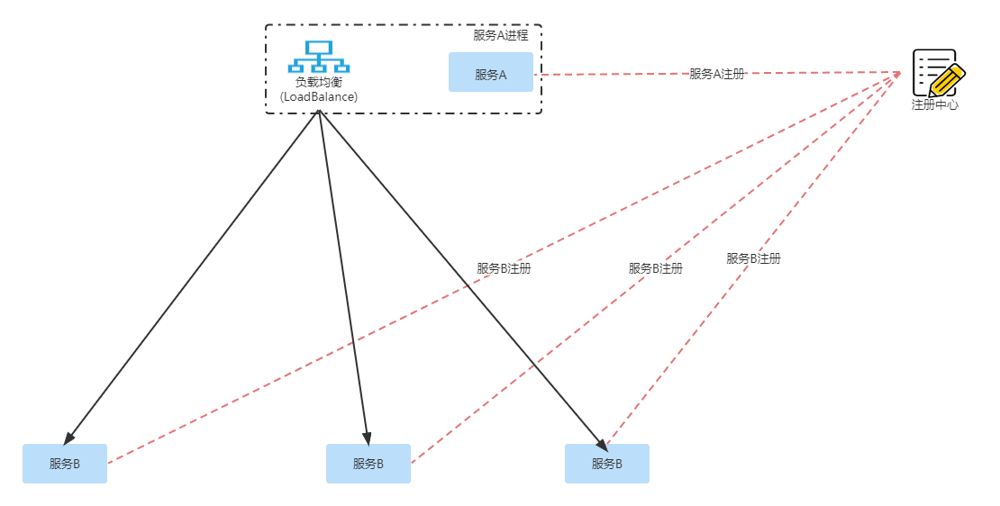
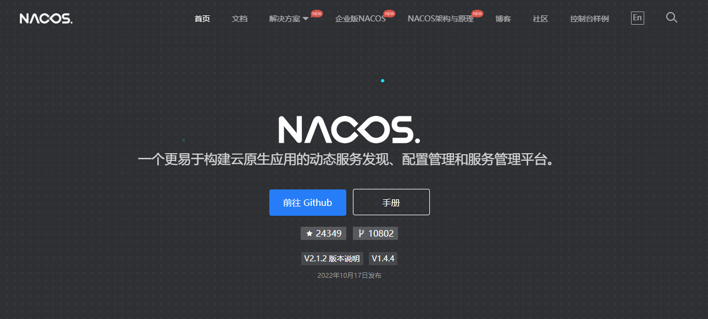
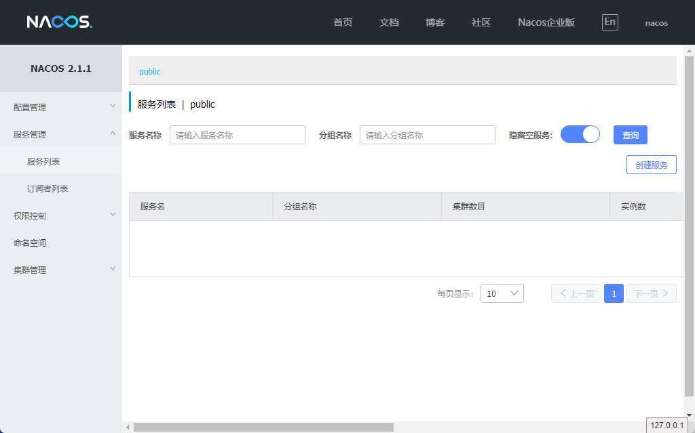
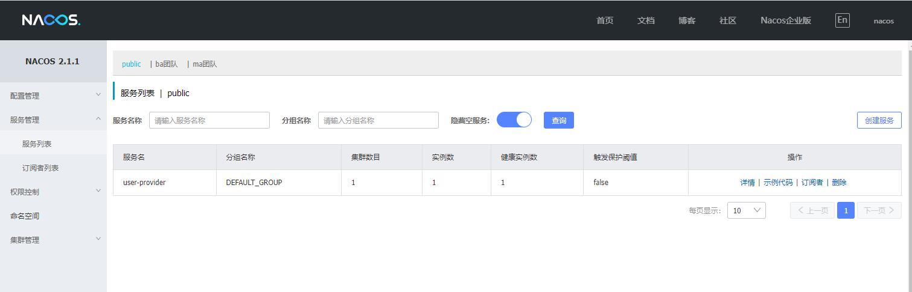

- [微服务组件（SpringCloudAlibaba）](#微服务组件springcloudalibaba)
  - [注册中心](#注册中心)
    - [一些概念](#一些概念)
    - [Nacos](#nacos)
      - [快速启动单机测试](#快速启动单机测试)
    - [服务注册/发现: Nacos Discover](#服务注册发现-nacos-discover)
      - [通用配置](#通用配置)
      - [细节详解](#细节详解)
        - [配置引入](#配置引入)
        - [服务注册](#服务注册)
# 微服务组件（SpringCloudAlibaba）
目前SpringCloud已经是Java实现微服务架构的事实标准，在此基础上，阿里巴巴开源了SpringCloudAlibaba。替换了一些组件的实现，使用起来更方便、稳定，因此我们采用Alibaba这一套框架进行学习。

|名称|SpringCloud|SpringCloudAlibaba|
|--|--|--|
|注册中心|Eureka、Consul|Nacos|
|配置中心|SpringCloud Config|Nacos|
|网关|SpringCloud Zuul|SpringCLoud Gateway|
|负载均衡|Ribbon|LoadBalancer|
|熔断降级|Hysrix|Sentinel|
|服务调用|Feign|OpenFeign|

## 注册中心
### 一些概念
- 服务发现：比如服务A调用服务B，服务B负载过高时，需要再加一个节点，怎么让服务A发现这个新的服务B节点，这个过程就叫服务发现。  
- 服务注册：服务在启动时，向“注册中心”注册自己，建立一条ServiceName -> ip:port 的映射关系
- 注册中心：负责维护ServiceName -> ip:port列表的维护，同时与服务建立长链接，主动推送节点状态变更



### Nacos
Nacos本身是阿里巴巴开源的一个配置中心，其名字取自：Name and Config Service首字母。从[官网首页](https://nacos.io/zh-cn/index.html)就能发现它的核心功能在于：服务发现、配置管理。  



本文主要参考文档：
- [Nacos架构](https://nacos.io/zh-cn/docs/architecture.html)  

#### 快速启动单机测试
采用容器方式快速启动单机测试，具体见[NacosDocker](https://nacos.io/zh-cn/docs/quick-start-docker.html)。  

“配置管理”，可以将项目中的application.properties迁移到这里，做集中配置管理，这是Nacos最开始的功能。  
“服务管理”，做服务注册，与服务建立长链接，监听服务状态，推送节点上下线消息。



### 服务注册/发现: Nacos Discover
SpringCloudAlibaba通过Nacos进行服务注册发现，提供了Spring Cloud Alibaba Nacos Discovery组件来帮助我们把服务自动注册到Nacos服务端，并且能动态感知和刷新某个服务实例的节点列表。除此之外，Nacos Discovery也会将服务实例的一些元数据信息，例如host、port、健康检查url等内容注册到Nacos。  

详细接入流程可参考[SpringCloudAlibaba-服务注册与发现](https://spring-cloud-alibaba-group.github.io/github-pages/2021/zh-cn/index.html#_spring_cloud_alibaba_nacos_discovery)

#### 通用配置
1.配置Maven依赖
```maven
<dependency>
    <groupId>com.alibaba.cloud</groupId>
    <artifactId>spring-cloud-starter-alibaba-nacos-discovery</artifactId>
</dependency>
```

2.配置application.properties
```application.properties
# 项目启动端口
server.port=8081
# 服务名，会显示在Nacos服务管理-服务列表中
spring.application.name=nacos-provider
# Nacos服务地址，会通过这个一直进行服务注册
spring.cloud.nacos.discovery.server-addr=127.0.0.1:8848
# spring-boot-actuator组件的配置，暴露一些API出去，可以查询健康装填，甚至操作服务关闭，具体可选项看考[文档](https://docs.spring.io/spring-boot/docs/2.1.11.RELEASE/reference/html/production-ready-endpoints.html)
management.endpoints.web.exposure.include=*
```
3.使用@EnableDiscoveryClient注解

启动项目后，即可在Nacos服务列表看到已注册成功。


4.服务调用
这里演示用比较直白的方式来编码调用，后面会讲一下实际项目中用接口方式来声明调用，实际上声明调用只是用代理的方式做了增强处理，本质还是LoadBalance通过服务名选择ip端口，然后发起普通的http调用。  

4.1首先引入LoadBalance实现依赖,因为spring-cloud-starter-alibaba-nacos-discovery中只包含LoadBalance接口。
```maven
<dependency>
    <groupId>org.springframework.cloud</groupId>
    <artifactId>spring-cloud-starter-loadbalancer</artifactId>
    <version>3.1.4</version>
</dependency>
```

4.2通过LoadBalance获取服务实例并发起调用
```java
public List<VideoDTO> queryUserLoveVideos(Integer userId) {
    // 用user-provider获取服务实例
    ServiceInstance serviceInstance = loadBalancerClient.choose("user-provider");
    // 拼接请求地址
    String url = String.format("http://%s:%s/user/%s", serviceInstance.getHost(), serviceInstance.getPort(), userId);
    // HTTPSdk直接发起请求
    Result<UserDTO> userRes = restTemplate.getForObject(url, Result.class);
    if (userRes == null || userRes.getData() == null) {
        throw new RuntimeException("用户不存在");
    }
    return userLoveRepository.get(userId);
}
```
#### 细节详解
接下来将从细节方面详细了解服务注册整个流程，以及一些细节方面的实现。  
##### 配置引入
查看spring-cloud-starter-alibaba-nacos-discovery包的，spring.factories文件。
> spring.factories文件负责帮助SpringBoot装配一些配置类。[详情可查看该文章](https://blog.csdn.net/SkyeBeFreeman/article/details/96291283)

```properties
org.springframework.boot.autoconfigure.EnableAutoConfiguration=\
  com.alibaba.cloud.nacos.discovery.NacosDiscoveryAutoConfiguration,\
  com.alibaba.cloud.nacos.endpoint.NacosDiscoveryEndpointAutoConfiguration,\
  com.alibaba.cloud.nacos.registry.NacosServiceRegistryAutoConfiguration,\
  com.alibaba.cloud.nacos.discovery.NacosDiscoveryClientConfiguration,\
  com.alibaba.cloud.nacos.discovery.reactive.NacosReactiveDiscoveryClientConfiguration,\
  com.alibaba.cloud.nacos.discovery.configclient.NacosConfigServerAutoConfiguration,\
  com.alibaba.cloud.nacos.loadbalancer.LoadBalancerNacosAutoConfiguration,\
  com.alibaba.cloud.nacos.NacosServiceAutoConfiguration,\
  com.alibaba.cloud.nacos.utils.UtilIPv6AutoConfiguration
org.springframework.cloud.bootstrap.BootstrapConfiguration=\
  com.alibaba.cloud.nacos.discovery.configclient.NacosDiscoveryClientConfigServiceBootstrapConfiguration
org.springframework.context.ApplicationListener=\
  com.alibaba.cloud.nacos.discovery.logging.NacosLoggingListener
```

图中的的NacosServiceRegistryAutoConfiguration看起来像是跟注册有关系，我们看下这个配置类。

```java
@Configuration(proxyBeanMethods = false)
@EnableConfigurationProperties
@ConditionalOnNacosDiscoveryEnabled
@ConditionalOnProperty(value = "spring.cloud.service-registry.auto-registration.enabled",
		matchIfMissing = true)
@AutoConfigureAfter({ AutoServiceRegistrationConfiguration.class,
		AutoServiceRegistrationAutoConfiguration.class,
		NacosDiscoveryAutoConfiguration.class })
public class NacosServiceRegistryAutoConfiguration {

	@Bean
	public NacosServiceRegistry nacosServiceRegistry(
			NacosServiceManager nacosServiceManager,
			NacosDiscoveryProperties nacosDiscoveryProperties) {
		return new NacosServiceRegistry(nacosServiceManager, nacosDiscoveryProperties);
	}

	@Bean
	@ConditionalOnBean(AutoServiceRegistrationProperties.class)
	public NacosRegistration nacosRegistration(
			ObjectProvider<List<NacosRegistrationCustomizer>> registrationCustomizers,
			NacosDiscoveryProperties nacosDiscoveryProperties,
			ApplicationContext context) {
		return new NacosRegistration(registrationCustomizers.getIfAvailable(),
				nacosDiscoveryProperties, context);
	}

	@Bean
	@ConditionalOnBean(AutoServiceRegistrationProperties.class)
	public NacosAutoServiceRegistration nacosAutoServiceRegistration(
			NacosServiceRegistry registry,
			AutoServiceRegistrationProperties autoServiceRegistrationProperties,
			NacosRegistration registration) {
		return new NacosAutoServiceRegistration(registry,
				autoServiceRegistrationProperties, registration);
	}

}
```

可以看到，项目启动后，NacosServiceRegistry会完成注册动作。

##### 服务注册
服务注册逻辑在NacosServiceRegistry类中
```java
	@Override
	public void register(Registration registration) {

		if (StringUtils.isEmpty(registration.getServiceId())) {
			log.warn("No service to register for nacos client...");
			return;
		}
        // 获取NameService
		NamingService namingService = namingService();
		String serviceId = registration.getServiceId();
        // 从配置文件里获取groupName
		String group = nacosDiscoveryProperties.getGroup();
        // 把SpringCloud的Registration对象转化为Nacos的Instance对象
		Instance instance = getNacosInstanceFromRegistration(registration);

		try {
            // 通过NameService注册实例
			namingService.registerInstance(serviceId, group, instance);
			log.info("nacos registry, {} {} {}:{} register finished", group, serviceId,
					instance.getIp(), instance.getPort());
		}
		catch (Exception e) {
            // fail-fast，默认是true，如果注册失败应用不能启动
			if (nacosDiscoveryProperties.isFailFast()) {
				log.error("nacos registry, {} register failed...{},", serviceId,
						registration.toString(), e);
				rethrowRuntimeException(e);
			}
			else {
                // 关闭fail-fast，注册失败也能启动应用
				log.warn("Failfast is false. {} register failed...{},", serviceId,
						registration.toString(), e);
			}
		}
	}
```

继续跟踪namingService.registerInstance(serviceId, group, instance);这个方法

```java
    // 1. NacosNameService, 使用NamingClientProxyDelegate调用registerService方法，继续往下追
    @Override
    public void registerInstance(String serviceName, String groupName, Instance instance) throws NacosException {
        NamingUtils.checkInstanceIsLegal(instance);
        clientProxy.registerService(serviceName, groupName, instance);
    }

    // 2. NamingClientProxyDelegate的registerService方法中根据这个实例是否临时实例来选择请求协议，临时实例用gRPC，永久实例用HTTP
    @Override
    public void registerService(String serviceName, String groupName, Instance instance) throws NacosException {
        getExecuteClientProxy(instance).registerService(serviceName, groupName, instance);
    }

    private NamingClientProxy getExecuteClientProxy(Instance instance) {
        return instance.isEphemeral() ? grpcClientProxy : httpClientProxy;
    }

    // 3. 以HttpClientProxy为例来看下,注册时会把配置文件里的各种参数，以及元数据都会提交上去
    @Override
    public void registerService(String serviceName, String groupName, Instance instance) throws NacosException {
        
        NAMING_LOGGER.info("[REGISTER-SERVICE] {} registering service {} with instance: {}", namespaceId, serviceName,
                instance);
        String groupedServiceName = NamingUtils.getGroupedName(serviceName, groupName);
        if (instance.isEphemeral()) {
            BeatInfo beatInfo = beatReactor.buildBeatInfo(groupedServiceName, instance);
            beatReactor.addBeatInfo(groupedServiceName, beatInfo);
        }
        final Map<String, String> params = new HashMap<String, String>(32);
        params.put(CommonParams.NAMESPACE_ID, namespaceId);
        params.put(CommonParams.SERVICE_NAME, groupedServiceName);
        params.put(CommonParams.GROUP_NAME, groupName);
        params.put(CommonParams.CLUSTER_NAME, instance.getClusterName());
        params.put(IP_PARAM, instance.getIp());
        params.put(PORT_PARAM, String.valueOf(instance.getPort()));
        params.put(WEIGHT_PARAM, String.valueOf(instance.getWeight()));
        params.put("enable", String.valueOf(instance.isEnabled()));
        params.put(HEALTHY_PARAM, String.valueOf(instance.isHealthy()));
        params.put(EPHEMERAL_PARAM, String.valueOf(instance.isEphemeral()));
        params.put(META_PARAM, JacksonUtils.toJson(instance.getMetadata()));
        
        reqApi(UtilAndComs.nacosUrlInstance, params, HttpMethod.POST);
    }

    // 4. 这里只关注nacos集群情况下，他会调哪个server就好
      public String reqApi(String api, Map<String, String> params, Map<String, String> body, List<String> servers,
            String method) throws NacosException {
        
        params.put(CommonParams.NAMESPACE_ID, getNamespaceId());
        
        if (CollectionUtils.isEmpty(servers) && !serverListManager.isDomain()) {
            throw new NacosException(NacosException.INVALID_PARAM, "no server available");
        }
        
        NacosException exception = new NacosException();
        
        // 如果配置的nacos地址是域名，会走这个逻辑，直接请求，如果配置的是ip，但是只配置了一个，也会走域名的逻辑
        if (serverListManager.isDomain()) {
            String nacosDomain = serverListManager.getNacosDomain();
            for (int i = 0; i < maxRetry; i++) {
                try {
                    return callServer(api, params, body, nacosDomain, method);
                } catch (NacosException e) {
                    exception = e;
                    if (NAMING_LOGGER.isDebugEnabled()) {
                        NAMING_LOGGER.debug("request {} failed.", nacosDomain, e);
                    }
                }
            }
        } else {
            // 如果地址配置了数组，会随机取一个来访问
            Random random = new Random(System.currentTimeMillis());
            int index = random.nextInt(servers.size());
            
            for (int i = 0; i < servers.size(); i++) {
                String server = servers.get(index);
                try {
                    return callServer(api, params, body, server, method);
                } catch (NacosException e) {
                    exception = e;
                    if (NAMING_LOGGER.isDebugEnabled()) {
                        NAMING_LOGGER.debug("request {} failed.", server, e);
                    }
                }
                index = (index + 1) % servers.size();
            }
        }
        
        NAMING_LOGGER.error("request: {} failed, servers: {}, code: {}, msg: {}", api, servers, exception.getErrCode(),
                exception.getErrMsg());
        
        throw new NacosException(exception.getErrCode(),
                "failed to req API:" + api + " after all servers(" + servers + ") tried: " + exception.getMessage());
        
    }
```