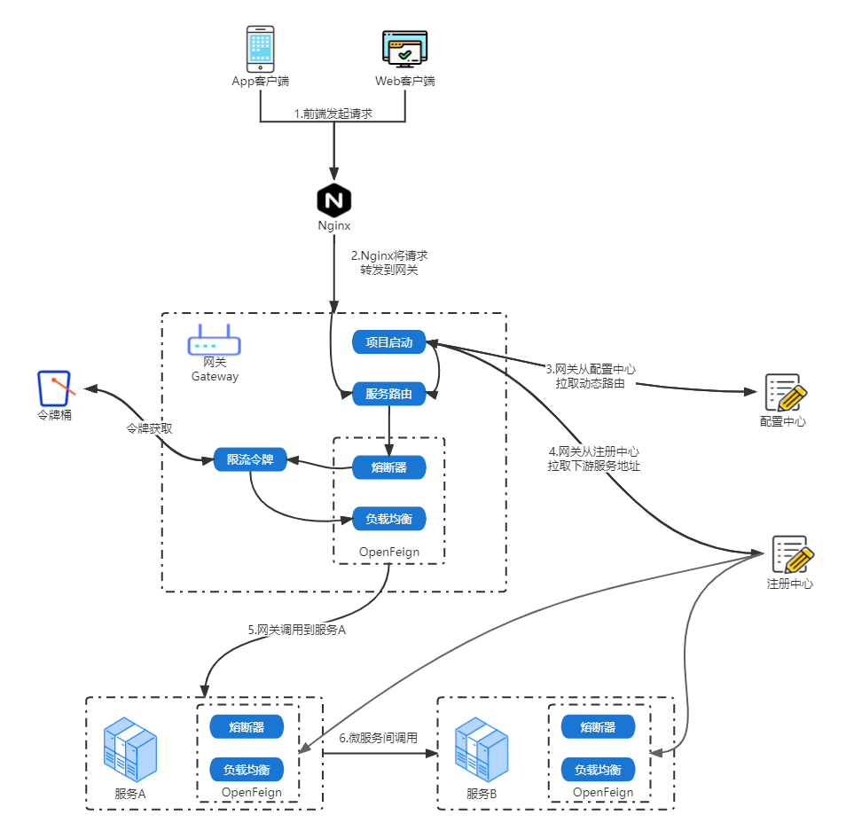

- [微服务组件（SpringCloudAlibaba）](#微服务组件springcloudalibaba)
  - [微服务组件合作方式](#微服务组件合作方式)
  - [注册中心](#注册中心)
    - [一些概念](#一些概念)
    - [Nacos](#nacos)
      - [快速启动单机测试](#快速启动单机测试)
    - [服务注册/发现: Nacos Discover](#服务注册发现-nacos-discover)
      - [通用配置](#通用配置)
      - [常见问题](#常见问题)
        - [订阅者概念](#订阅者概念)
        - [订阅者列表中应用名为unknown](#订阅者列表中应用名为unknown)
# 微服务组件（SpringCloudAlibaba）
目前SpringCloud已经是Java实现微服务架构的事实标准，在此基础上，阿里巴巴开源了SpringCloudAlibaba。替换了一些组件的实现，使用起来更方便、稳定，因此我们采用Alibaba这一套框架进行学习。

|名称|SpringCloud|SpringCloudAlibaba|
|--|--|--|
|注册中心|Eureka、Consul|Nacos|
|配置中心|SpringCloud Config|Nacos|
|网关|SpringCloud Zuul|SpringCLoud Gateway|
|负载均衡|Ribbon|LoadBalancer|
|熔断降级|Hysrix|Sentinel|
|服务调用|Feign|OpenFeign|

## 微服务组件合作方式

## 注册中心
### 一些概念
- 服务发现：比如服务A调用服务B，服务B负载过高时，需要再加一个节点，怎么让服务A发现这个新的服务B节点，这个过程就叫服务发现。  
- 服务注册：服务在启动时，向“注册中心”注册自己，建立一条ServiceName -> ip:port 的映射关系
- 注册中心：负责维护ServiceName -> ip:port列表的维护，同时与服务建立长链接，主动推送节点状态变更


### Nacos
Nacos本身是阿里巴巴开源的一个配置中心，其名字取自：Name and Config Service首字母。从[官网首页](https://nacos.io/zh-cn/index.html)就能发现它的核心功能在于：服务发现、配置管理。  


本文主要参考文档：
- [Nacos架构](https://nacos.io/zh-cn/docs/architecture.html)  

#### 快速启动单机测试
采用容器方式快速启动单机测试，具体见[NacosDocker](https://nacos.io/zh-cn/docs/quick-start-docker.html)。  

“配置管理”，可以将项目中的application.properties迁移到这里，做集中配置管理，这是Nacos最开始的功能。  
“服务管理”，做服务注册，与服务建立长链接，监听服务状态，推送节点上下线消息。


### 服务注册/发现: Nacos Discover
SpringCloudAlibaba通过Nacos进行服务注册发现，提供了Spring Cloud Alibaba Nacos Discovery组件来帮助我们把服务自动注册到Nacos服务端，并且能动态感知和刷新某个服务实例的节点列表。除此之外，Nacos Discovery也会将服务实例的一些元数据信息，例如host、port、健康检查url等内容注册到Nacos。  

详细接入流程可参考[SpringCloudAlibaba-服务注册与发现](https://spring-cloud-alibaba-group.github.io/github-pages/2021/zh-cn/index.html#_spring_cloud_alibaba_nacos_discovery)

#### 通用配置
SpringBootCloud启动配置非常简单。  

1.配置Maven依赖
```maven
<dependency>
    <groupId>com.alibaba.cloud</groupId>
    <artifactId>spring-cloud-starter-alibaba-nacos-discovery</artifactId>
</dependency>
```

2.配置application.properties
```application.properties
# 项目启动端口
server.port=8081
# 服务名，会显示在Nacos服务管理-服务列表中
spring.application.name=nacos-provider
# Nacos服务地址，会通过这个一直进行服务注册
spring.cloud.nacos.discovery.server-addr=127.0.0.1:8848
# spring-boot-actuator组件的配置，暴露一些API出去，可以查询健康装填，甚至操作服务关闭，具体可选项看考[文档](https://docs.spring.io/spring-boot/docs/2.1.11.RELEASE/reference/html/production-ready-endpoints.html)
management.endpoints.web.exposure.include=*
```

启动项目后，即可在Nacos服务列表看到已注册成功。


3.服务调用  

这里演示用比较直白的方式来编码调用，后面会讲一下实际项目中用接口方式来声明调用，实际上声明调用只是用代理的方式做了增强处理，本质还是LoadBalance通过服务名选择ip端口，然后发起普通的http调用。  

3.1首先引入LoadBalance实现依赖,因为spring-cloud-starter-alibaba-nacos-discovery中只包含LoadBalance接口。
```maven
<dependency>
    <groupId>org.springframework.cloud</groupId>
    <artifactId>spring-cloud-starter-loadbalancer</artifactId>
    <version>3.1.4</version>
</dependency>
```

3.2通过LoadBalance获取服务实例并发起调用
```java
public List<VideoDTO> queryUserLoveVideos(Integer userId) {
    // 用user-provider获取服务实例
    ServiceInstance serviceInstance = loadBalancerClient.choose("user-provider");
    // 拼接请求地址
    String url = String.format("http://%s:%s/user/%s", serviceInstance.getHost(), serviceInstance.getPort(), userId);
    // HTTPSdk直接发起请求
    Result<UserDTO> userRes = restTemplate.getForObject(url, Result.class);
    if (userRes == null || userRes.getData() == null) {
        throw new RuntimeException("用户不存在");
    }
    return userLoveRepository.get(userId);
}
```

#### 常见问题
##### 订阅者概念
服务A调用服务B提供的服务，那服务A就是服务B的订阅者，相当于订阅了服务B的服务。  
Nacos订阅者列表里除了会该服务的订阅者（消费者），还会有该服务本身。  
##### 订阅者列表中应用名为unknown
Nacos读取系统变量里的: project.name 来设置为应用名，它与服务名不同，服务名是SpringCloudAlibabaNacos模块读取Spring的application.name设置的。Nacos并不准备统一两者。  
[AppName Unknown Issue](https://github.com/alibaba/nacos/issues/8553)